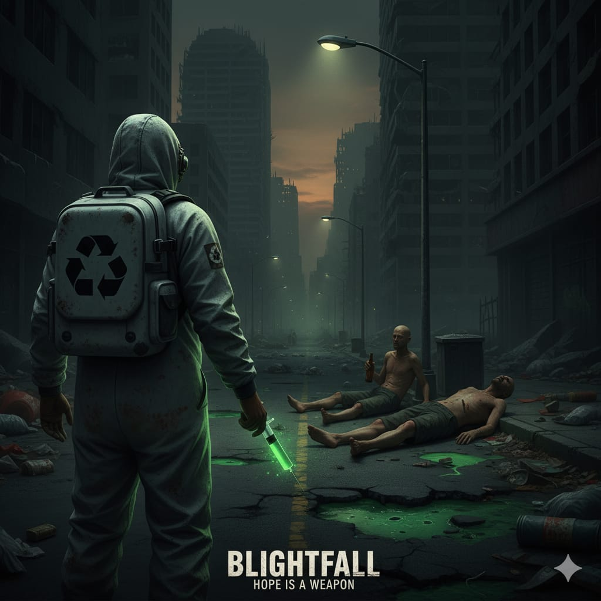

# **Game Name: Blightfall**

## **What is the story?**

The game is set in a **grim, near-future version of Earth** that has been abandoned due to catastrophic levels of pollution. The air is toxic, the cities are buried in garbage, and the environment itself is a wasteland. Those who could afford it escaped to pristine off-world colonies or sealed bio-domes, leaving the planet to rot.

However, not everyone was able to leave. The city's homeless population was left behind, forced to survive in this toxic new world. Over time, the constant exposure to chemical waste and pollution has created a sickness. This "**Blight**" is both a neurotoxin and a mutagen. It has warped their minds, making them paranoid, aggressive, and territorial, while also physically twisting their bodies into misshapen, tragic forms.

---

You are a **lone individual returning to this dead world**. Your purpose is to begin the seemingly impossible task of cleaning the planet, but to do so, you must confront the tragic fate of those who were left to suffer in it.

The second, deeper point is to make **moral choices** about the human cost of this disaster. The game constantly asks you to decide: do you spend your hard-earned resources to save these tragic victims (by using the Antidote), or do you prioritize your own survival and treat them as hostile obstacles that must be destroyed? The ultimate goal is to reclaim the planet, both its environment and, if you choose, the humanity of its forgotten people.

## **What can you encounter?**

You will encounter a **desolate and hostile world**. The streets are littered with mountains of trash, pools of chemical waste, and the crumbling ruins of a forgotten civilization.

The primary inhabitants you will encounter are the **Blighted**. These are the mutated remnants of the homeless population.

*   **Appearance:** Their skin is a **sickly brownish-green color**, a result of their constant exposure to toxins. The pollution has mutated their bodies, causing grotesque deformities like one arm being much larger and more powerful than the other, or other unnatural growths.

*   **Behavior:** From a distance, they are not immediately hostile. You might see them scavenging or walking around.

*   **Hostility:** They become hostile when you enter a certain range around them, as their sickness makes them extremely territorial. They will shout, throw bottles at you, and try to strike you with their mutated limbs.

## **What should the player do?**

The player's main objective is to **clean the environment**. You will walk around the map and collect garbage - used bottles or old plastics. Simply walking over a piece of garbage automatically picks it up and adds it to your backpack.

Your backpack has a capacity of **5 garbage units**. Once it's full, the contents are automatically processed and converted into **one dose of the "Antidote".** This antidote is the only thing capable of curing the Blight sickness. Once crafted, the antidote is stored in your inventory (where it can be stacked infinitely), and your backpack's garbage capacity is reset to zero, allowing you to continue collecting.

You also have a **health bar**. The Blighted will attack you when you get in range, throwing things like beer bottles at you. You need to move to avoid their attacks. If you get hit, you lose health points (HP). If you lose all your HP, you die and need to restart the game. Collecting garbage also slightly restores your own health, rewarding you for cleaning.

As you explore, you will inevitably encounter the Blighted. When you get close to them, you have two main options:

   a) **Heal them:** You can use one of your stored Antidotes on a Blighted individual. This will cure them of their sickness, effectively saving them and removing them as a threat.

   b) **Fight them:** If you don't have an antidote or you are attacked, you must defend yourself.

